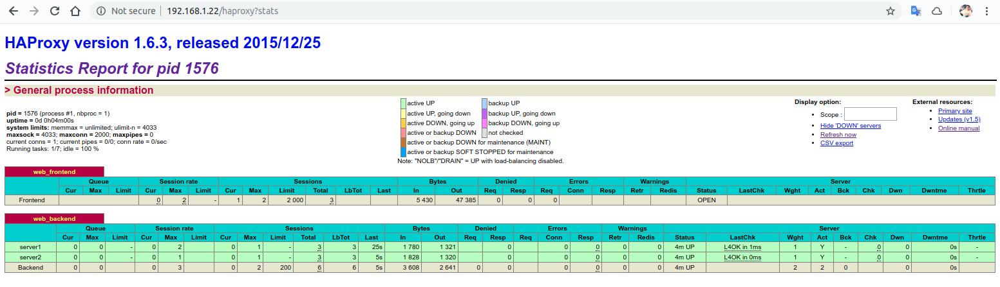
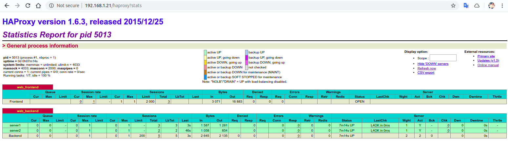

<h1>HAProxy ve Keepalived ile Load Balancing</h1>

Bu yazımda HAProxy'den bahsedip Keepalived ile kullanımını örnek senaryo üzerinden açıklamaya çalışacağım. Ama öncesinde Proxy Server ve Load Balancing konularına değinmemiz gerektiğini düşünüyorum.
<h2 id="proxy-server">Proxy Server </h2>
Türkçesi Vekil Sunucudur. İstemci ile Sunucu arasında yer alan, istemcinin gönderdiği istekleri yönlendiren <strong>ara sunucudur</strong>. 
<ul><li>Ağ içerisindeki tüm kullanıcılar tek bir adres üzerinden ağ dışına çıkacaklarından dolayı, kullanıcıların IP adresleri gizlenmiş olunur. Böylece iç ağdaki kullanıcılar dışarıdan gelecek saldırılara karşı korunur.</li><li>Erişime engelli sitelere girmek için kullanılabilir. Web sunucusuna istekte bulunacak olan Proxy sunucudur.</li><li>Çok fazla ziyaret edilen bir sayfa Proxy sunucunun önbelleğine alınarak istekte bulunan bilgisayara önbelleğinden web sayfasını göndererek erişim hızını artırır.</li></ul><figure class="kg-card kg-image-card"></figure><h2 id="load-balancing">Load Balancing</h2>
Akılda kalıcı bir örnek üzerinden anlatcağım. Bu web sayfasının yayınlandığı web sunucusu günde 20 istek alsa benim için bir sıkıntı olmaz ama 20000 istek alırsa o zaman sıkıntı çıkar ve isteklere cevap veremez. Sunucuyu daha da güçlü hale getirmeye(ram, cpu vs) kalksak da nereye kadar. E o zaman bir tane web sunucu yerine birden fazla sunucu kullanıp gelen istekleri bu sunuculara dağıtırsam çok daha verimli olacaktır. Türkçe'de bunun adı 'Yük Dengeleme'dir. Load Balancer denen sunucu <strong>HTTP</strong>, <strong>HTTPS</strong>, <strong>TCP</strong> ve <strong>UDP</strong> trafik türlerini desteklemektedir. Yük Dengeleme ile,
<ul><li>Yedeklik</li><li>Güvenirlik</li><li>Süreklilik sağlanır.</li></ul><figure class="kg-card kg-image-card"></figure>
Peki Load Balancing'den sorumlu sunucuya gelen isteğin hangi sunucuya yönlendirileceği nasıl belirlenir ?
<h2 id="load-balancing-algoritmalari">Load Balancing Algoritmalari</h2><ul><li><strong>Round Robin : </strong>İstekler, sunuculara sırasıyla yönlendirilir. </li><li><strong>Least Connection : </strong>İstek, en az bağlantıya sahip olan sunuyuca yönlendirilir.</li><li><strong>Source (IP Hash)</strong> <strong>: </strong>Belirlenen IP Adresinden gelen istekler her zaman aynı sunucuya yönlendirilir.</li></ul>
Teoride kafamızda bir şeyler canlanmıştır. Şimdi ise asıl konumuz olan HAProxy'e giriş yapıp uygulama üzerinden konuya daha da hakim olalım.

<h2 id="haproxy">HAProxy</h2>
HAProxy, yüksek erişilebilirliğe sahip yük dengeleyici ile TCP ve HTTP tabanlı uygulamalar için proxy sunucusu hizmeti veren açık kaynak kodlu bir yazılımdır. 
<figure class="kg-card kg-image-card"></figure>
İlk senaryomuzda 1 tane HAProxy Server ve 2 tane Web Server olacak. Sunuculara static IP adresi vermek için bu <a href="https://askubuntu.com/questions/264768/how-to-configure-static-ip-in-ubuntu-running-on-virtual-box"><strong>linke</strong></a> göz atabilirsiniz.
<pre><code class="language-bash">$ sudo apt install haproxy
$ cd /etc/haproxy/
$ sudo cp haproxy.cfg haproxy.cfg.old  # yedekleme
$ sudo vi haproxy.cfg
</code></pre>

 Açılan sayfanın en altına şu satırlar eklenir,
<pre><code class="language-wiki">frontend web_frontend
        bind *:80
        stats uri /haproxy?stats
        default_backend web_backend
        
backend web_backend
        balance roundrobin
        mode    http
        option  http-server-close
        server  server1 ip:80 check
        server  server2 ip:80 check
</code></pre>

Web Sunucuları için bu <a href="https://www.digitalocean.com/community/tutorials/how-to-install-the-apache-web-server-on-ubuntu-18-04-quickstart"><strong>linkte</strong></a> yer alan Apache kurulumunu yapıp, ip yazan kısımları güncelliyoruz. server1 ve server2 isimleri bize bağlı. Apache kurulumundaki index.html dosyasında hangi server'a ait olduğunu da belirttim. Bunu proxy sunucuya istek yapınca hangi web sunucusundan sayfanın geldiğini anlamak için yaptım.
<pre><code class="language-wiki">frontend web_frontend
        bind *:80
        stats uri /haproxy?stats
        default_backend web_backend
        
backend web_backend
        balance roundrobin
        mode    http
        option  http-server-close
        server  server1 192.168.1.25:80 check
        server  server2 192.168.1.24:80 check
</code></pre>
<pre><code class="language-bash">$ sudo systemctl restart haproxy
</code></pre>

Notlarımızı alacak olursak,
<ul><li>192.168.1.22 - HAProxy</li><li>192.168.1.25 - Web server 1</li><li>192.168.1.24 - Web server 2</li></ul>
Bu adımların ardından gözlemlerimizi yapabiliriz. Öncelikle server1 ve server2 adreslerini görüntüleyelim.
<figure class="kg-card kg-image-card"></figure><figure class="kg-card kg-image-card"></figure>
HAPorxy sunucusunun adresi 192.168.1.22 idi. Tarayıcıdan bu adresi girdiğmizde <strong>roundrobin</strong> algoritmasına göre öncelikle server1 görüntülenir. Sayfayı tekrar yenilersek bu sefer algoritma gereği server2 sayfası görüntülenir.
<figure class="kg-card kg-image-card"></figure><figure class="kg-card kg-image-card"></figure>
<strong>haproxy.cfg</strong> dosyasındaki <code>stats uri /haproxy?stats</code> satırı ile HAProxy'de tutulan çeşitli verilere (en basitinden hangi sunucuya kaç istek yapıldığı bilgisi vb.), hangi url ile erişebileceğimizi belirttik. Bunun için tarayıcıdan <code>192.168.1.22/haproxy?stats</code> adresini girelim.
<figure class="kg-card kg-image-card"></figure>
Resimden de anlaşıldığı üzere server1 için 3 istek ve server2 için 3 istek toplamda 6 isteğe cevap verdiği gözükmekte. Buradan bir sonraki isteğin roundrobin'e göre server1'e yönlendirileceğini anlayabiliyoruz.

Şimdi de uygulamamıza bir tane daha HAProxy sunucusu ekleyelim. Bu sunucuyla beraber sunucu sayısı dörde çıkmış oldu.
<ul><li>192.168.1.22 - HAProxy 1</li><li>192.168.1.23 - HAProxy 2</li><li>192.168.1.25 - Web server 1</li><li>192.168.1.24 - Web server 2</li></ul><h2 id="keepalived-ve-virtual-ip">Keepalived ve Virtual IP</h2>
Keepalived,<strong><strong> </strong></strong>IP failover(yük devretme) yeteneğini ikiden daha fazla sunucu için sağlayacak yeteneğe sahip açık kaynak kodlu bir yazılımdır.Keepalived’i IP devretmek için kullanacağız.

İki tane HAProxy sunucusu iki tane IP adresi demektir. Bu sunucular için Virtual IP dediğimiz tek bir IP adresi belirleyerek aslında tek bir IP Adresi varmış gibi devam edeceğiz. Birinci HAProxy sunucusunu (192.168.1.22) <strong>MASTER</strong>, ikinci HAProxy sunucusunu da <strong>BACKUP</strong> olarak yapılandıracağız. Virtual IP olarak da <strong>192.168.1.21 </strong>adresini belirlediğimizi düşünürsek, istek ilk önce MASTER HAproxy sunucuya gelir ve bu sunucu 192.168.1.21 sanal IP adresini alacak. Eğer MASTER HAProxy sunucu down durumuna gelecek olursa da bu sefer Virtual IP adresini BACKUP olarak nitelendirdiğimiz ikinci HAProxy sunucu alacaktır. Bu kısmı roundrobin algoritması ile karıştırmamak lazım, buradaki yapı master-slave ilişkisine dayanır.

Öncelikle MASTER olacak olan 192.168.1.22 adresli HAProxy sunucu için Keepalived kurulumunu yapalım.
<pre><code class="language-bash">$ sudo apt install keepalived
$ cd /etc/keepalived
$ sudo vi keepalived.conf
</code></pre>
<pre><code class="language-wiki">vrrp_sync_group haproxy {
        group {
                VI_01
        }
}

vrrp_script haproxy_check_script {
        script &quot; kill -0 `cat /var/run/haproxy.pid`&quot;
        interval 2 # checking every 5 seconds (default: 5 seconds)
        fall 3 # require 3 failures for KO (default: 3)
        rise 6 # require 6 successes for OK (default: 6)
}

#Virtual interface
vrrp_instance VI_01 {
        state MASTER
        interface enp0s3 # choose interface netstat -i
        virtual_router_id 61
        priority 100
        authentication {
                auth_type PASS
                auth_pass 123456 # same password all keepalived server
        }

        # Virtual ip address - floating ip
        virtual_ipaddress {
                192.168.1.21
        }

        track_script {
                haproxy_check_script
        }

}
</code></pre>
<pre><code class="language-bash">$ sudo systemctl restart keepalived
$ sudo systemctl restart haproxy
</code></pre>

Bu işlemlerin aynısını diğer HAProxy sunucu için de yapıyoruz. Değişiklik gösterecek olan kısımlar,
<ul><li>state BACKUP</li><li>priority 99 : daha düşük öncelikli olduğunu belirtiyoruz.</li></ul><pre><code class="language-wiki">vrrp_sync_group haproxy {
        group {
                VI_01
        }
}

vrrp_script haproxy_check_script {
        script &quot; kill -0 `cat /var/run/haproxy.pid`&quot;
        interval 2 # checking every 5 seconds (default: 5 seconds)
        fall 3 # require 3 failures for KO (default: 3)
        rise 6 # require 6 successes for OK (default: 6)
}

#Virtual interface
vrrp_instance VI_01 {
        state BACKUP
        interface enp0s3 # choose interface netstat -i
        virtual_router_id 61
        priority 99
        authentication {
                auth_type PASS
                auth_pass 123456 # same password all keepalived server
        }

        # Virtual ip address - floating ip
        virtual_ipaddress {
                192.168.1.21
        }

        track_script {
                haproxy_check_script
        }

}
</code></pre>
<pre><code class="language-bash">$ sudo systemctl restart keepalived
$ sudo systemctl restart haproxy
</code></pre>

Tarayıcıdan artık HAProxy sunucularının IP adresleri üzerinden erişmek yerine belirlediğimiz Virtual IP ile erişebiliriz diyecektim ki :) problem yaşadım neyseki faydalandığım kaynaklardan birinde bu durumun çözümü anlatılmış.
<blockquote>Sunucularda “<strong><strong>net.ipv4.ip_nonlocal_bind=1</strong></strong>” olması gerekiyor. Yoksa <strong><strong>HAProxy</strong></strong> için kullanılacak yapılandırma üzerinde aynı anda aynı ip yi barındıramayacağı için bind hatası verecek ve servis çalışmayacaktır. Bunun için aşağıdaki yolu izlemeniz gerekiyor. İlk olarak “<strong><strong>vi /etc/sysctl.conf</strong></strong>” dosyasının için edit edin ve aşağıdaki parametreyi yapıştırıp kaydedip çıkın.  <strong><strong>net.ipv4.ip_nonlocal_bind=1</strong></strong>  Kaynak: [11]</blockquote><figure class="kg-card kg-image-card"></figure><figure class="kg-card kg-image-card"></figure><figure class="kg-card kg-image-card"></figure>
Şuanda 192.168.1.21 adresini MASTER HAProxy almakta. Eğer bu sunucu down olursa o zaman Virtual IP Adresini diğer HAProxy alır.

Yazıyı burada sonlandırıyorum. Umarım açıklayıcı ve faydalı olmuştur. Faydalandığım kaynakları aşağıda belirttim. Başka bir blog yazısında görüşmek üzere.

[1] <a href="https://www.digitalocean.com/community/tutorials/how-to-set-up-highly-available-haproxy-servers-with-keepalived-and-floating-ips-on-ubuntu-14-04">How To Set Up Highly Available HAProxy Servers with Keepalived and Floating IPs on Ubuntu 14.04</a> [2] <a href="https://www.youtube.com/watch?v=-c-EQiVD1HY">HAProxy + Keepalived</a> (Video) [3] <a href="https://www.unixmen.com/configure-high-available-load-balancer-haproxy-keepalived/">How To Configure A High Available Load-balancer With HAProxy And Keepalived</a> [4] <a href="https://www.haproxy.org/download/1.6/doc/configuration.txt">HAProxy Configuration Manual</a> [5] <a href="http://yurttasahmet.blogspot.com/2013/08/how-to-do-big-ip-load-balancing-bugunku.html" rel="bookmark">Load Balancing nedir ve Nasıl Yapılır?</a> [6] <a href="https://blog.vargonen.com/load-balancing-nedir-load-balancer-nasil-hangi-durumlarda-kullanilir/">Load Balancing Nedir? Load Balancer Nasıl ve Hangi Durumlarda Kullanılır?</a> [7] <a href="https://medium.com/@gguzelkokar.mdbf15/load-balancer-nedir-db8ab6e967ff">Load Balancer nedir ?</a> [8] <a href="https://medium.com/@gokhansengun/load-balancer-nedir-ve-ne-i%C5%9Fe-yarar-32d608f98ef9">Load Balancer nedir ve ne işe yarar?</a> [9] <a href="https://ersenaydemir.wordpress.com/2012/07/02/proxy-nedir-kullanim-amaci-ve-alanlari/">Proxy Nedir? Kullanım Amacı ve Alanları</a> [10] <a href="https://www.digitalocean.com/community/tutorials/an-introduction-to-haproxy-and-load-balancing-concepts">An Introduction to HAProxy and Load Balancing Concepts</a> [11] <a href="http://www.fatlan.com/haproxyloadbalancer-ve-keepalivedcluster-kurulum-ve-yapilandirmasi/">Haproxy(loadbalancer) ve Keepali̇ved(cluster) Kurulum ve Yapilandirmasi</a> [12] <a href="https://www.musabyardim.com/haproxy-ile-http-yuk-dengeleme/">HAProxy ile HTTP Yük Dengeleme</a>
